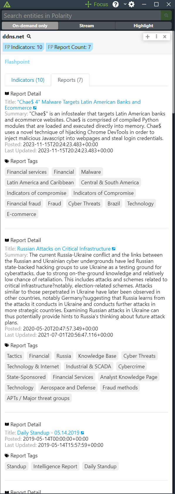

# Polarity - Flashpoint Integration

The Flashpoint API empowers experienced and entry-level users with the context they need to make better risk decisions about relevant threats such as cybercrime, fraud, and physical threats.

The Polarity Flashpoint integration allows Polarity to search Flashpoint's Indicators API to return threat information on IP's, Domains and File Hashes.

For more information on Flashpoint, please visit [official website](https://www.flashpoint-intel.com/).

Check out the integration in action:

|  |  
| --- | --- |
|*Flashpoint Indicator Information* | *Flashpoint Reports* |

## Flashpoint Integration Options

### Flashpoint API Base URL
The base URL for the Flashpoint API.  Defaults to https://fp.tools/api/v4/

### Flashpoint API Key

Valid Flashpoint API key generated on the "APIs & Integrations" page of fp.tools

### Ignore List 

This is an alternate option that can be used to specify domains or IPs that you do not want sent to Flashpoint.  The data must specify the entire IP or domain to be blocked (e.g., www.google.com is treated differently than google.com).

### Ignored Domain Regex

This option allows you to specify a regex to set domains.  Any domain matching the regex will not be looked up. 

### Ignored IP Regex

This option allows you to specify a regex to set IPv4 Addresses.  Any IPv4 matching the regex will not be looked up.  

## Installation Instructions

Installation instructions for integrations are provided on the [PolarityIO GitHub Page](https://polarityio.github.io/).

## Polarity

Polarity is a memory-augmentation platform that improves and accelerates analyst decision making.  For more information about the Polarity platform please see:

https://polarity.io/
